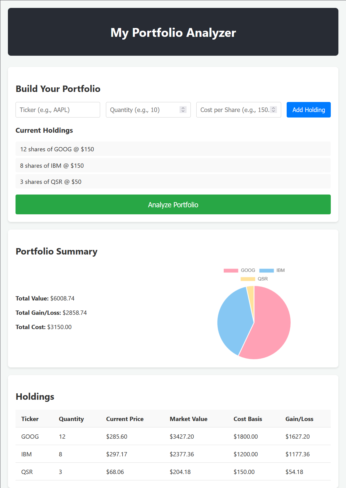

# 📈 Investment Portfolio Analyzer


A full-stack web application that simulates a real-time investment portfolio dashboard. It allows users to input their stock holdings, fetches live market data, and calculates key financial metrics like Unrealized Gain/Loss and Portfolio Allocation.

This project demonstrates the integration of a **Python/Flask** backend for data processing and a **React** frontend for a responsive user interface.

## 📸 Screenshot



## ✨ Features

* **Portfolio Management:** Users can input stock tickers, quantity, and cost basis.
* **Live Market Data:** Integrates with the **Alpha Vantage API** to fetch real-time stock prices.
* **Financial Analysis:** Automatically calculates:
    * Total Market Value
    * Unrealized Gain/Loss ($)
    * Portfolio Diversity (via Chart)
* **Visualizations:** Dynamic Pie Chart using **Chart.js** to visualize asset allocation.
* **Error Handling:** robust handling of invalid tickers or API network issues.

## 🛠️ Tech Stack

### Backend
* **Python 3:** Core logic.
* **Flask:** Lightweight web server and API construction.
* **Requests:** Handling external API calls.
* **Flask-CORS:** Managing Cross-Origin Resource Sharing for security.

### Frontend
* **React:** Component-based UI architecture.
* **Chart.js & React-Chartjs-2:** Data visualization.
* **CSS3:** Custom styling for a clean, professional look.

## 🚀 Getting Started

Follow these instructions to get the project up and running on your local machine.

### Prerequisites
* Node.js and npm installed
* Python 3 installed
* A free API Key from [Alpha Vantage](https://www.alphavantage.co/)

### 1. Backend Setup (Flask)

Navigate to the backend folder:
```bash
cd portfolio_analyzer
```

Create and activate a virtual environment:

```bash
# Windows
python -m venv venv
.\venv\Scripts\activate

# Mac/Linux
python3 -m venv venv
source venv/bin/activate
```

Install dependencies:

```bash
pip install -r requirements.txt
```

Create a file named .env in the portfolio_analyzer directory and add your Alpha Vantage API key to it:

```dotenv
ALPHA_VANTAGE_API_KEY="Your actual API Key goes here"
```
 >Note: The `.gitignore` file is already configured to prevent your `.env` file from being committed to version control, keeping your key secure.


Run the server:

```bash
python app.py
```

*The backend will run on `http://127.0.0.1:5000`*

### 2\. Frontend Setup (React)

Open a new terminal and navigate to the frontend folder:

```bash
cd portfolio-frontend
```

Install dependencies:

```bash
npm install
```

Start the React application:

```bash
npm start
```

*The frontend will launch automatically in your browser at `http://localhost:3000`*

## 🔮 Future Improvements

* **Database Integration:** Replace in-memory storage with PostgreSQL or MongoDB for persistent user data.
* **User Authentication:** Implement JWT Authentication to allow multiple users to log in securely.
* **Input Validation:** Add strict backend validation to sanitize user inputs against injection attacks.
* **Historical Data:** Add line charts to show portfolio value over time.

## 🛡️ Security & Deployment Notes

Currently, this project is configured for a **development environment** to make it easy to review and run locally:
* **Flask:** Runs in `debug=True` mode. **Warning:** This enables the interactive debugger and should never be exposed to the public internet to prevent Remote Code Execution (RCE) vulnerabilities.
* **React:** Runs via `npm start` (development server).

For a **production deployment**, I would:
1.  Serve the Flask app using a production WSGI server like **Gunicorn** behind Nginx.
2.  Build the React frontend using `npm run build` to generate optimized static assets.
3.  Disable debug mode and utilize environment variables to secure API keys.

## 📝 License

This project is open source and available under the [MIT License](LICENSE).
